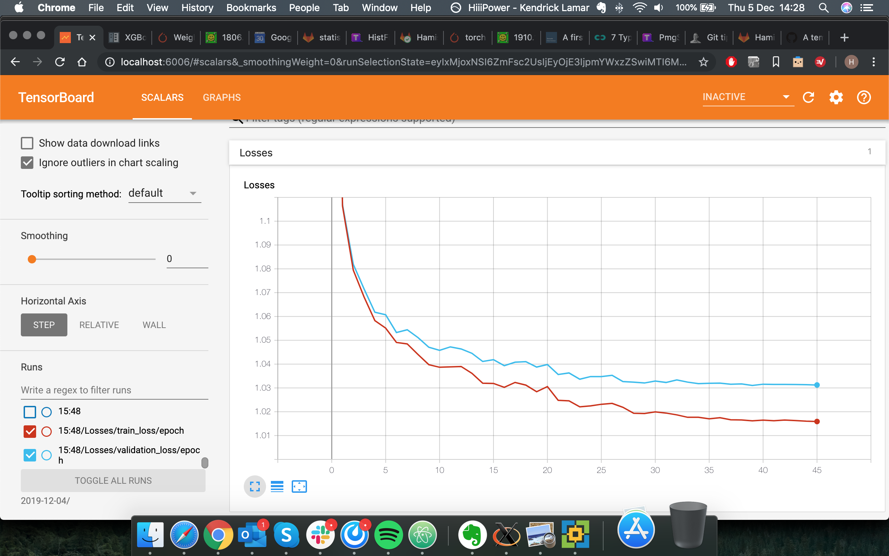
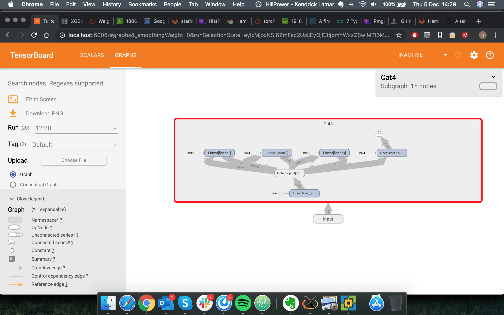

#Neural Nets and GBDTs

Modules for running Gradient-boosted decision trees with XGBoost and Neural Nets with PyTorch

## Getting Started

Setup is via LCG set in :PAU/NNsetup.sh

```
lsetup "views LCG_96b x86_64-centos7-gcc8-opt"
```
centos7 is the most tested but SL6 should work as well.


### Input prep- datset.py
The data preparation is driven by the NN_driver.py. The inputs are prepared by importing samples using the Samples TChain modules. You should provide the background samples to load, the class numbers, class names, variables, and weights (optional) in the driver. The dataset module will load this into torch tensors and store the data in data/processed. The dataset is produced by the first time you call train.py, dataset.py will check for the datafile that is set and process one if it is not already done. You can also apply a pre-selection to your input data using the region input to the driver (regions defined using selection/<analysis>) eg:
```
python train.py -r SRB_NN_presel
```
will produce the dataset with the SRB_NN_presel selections.

---

### Running Neural Net-train.py

Run command:
```
python train.py
```
The dataset is loaded from data/processed/<dataset_name>.pt, and split into train/test.
The training is driven by NN_driver.py. You can specify general hyperparameters such as learning rate, batch_size etc here. You can plot the input variables for train and test (or skip as it's quite slow). The training will run with the networks avaiable in modules.py. There are some tweaks to be done for binary vs multi-class setups...in to-do list to make this general. The train and test loss are reported after each epoch. The training stops either at the end of the specified number of epochs or if the validation loss doesn't decrease for 5 epochs. After succesful training, a new directory in runs with the date and time is made. The train/test scores for signal vs background are drawn, ROC curve is drawn and ROC-AUC score calculated and the model is writen out to model.pt in this directory. The driver and the modules.py for this run are also copied to the run directory for replcation of training.

### Running with XGBoost-train_xgboost.py
Run command:
```
python train_xgboost.py
```

The dataset is loaded from data/processed/<dataset_name>.pt, and split into train/test.
The training is driven by XGB_driver.py. The run is the same as with the NN, with all outputs saved in the run directory.

###Tensorboard- tesnsorboard_modules.py and XGB_board.py
During training the train/validation losses and the model are written to Tensorboard. This module, sets up a locally hosted web page for tracking the training in real time. These outputs are also written to runs/date/time. The best way to run this feature is to mount the runs directory to you computer and run tensorboard locally with:
```
tesnsorboard --logidr=<rundir>
```



This will host a page like this on http://localhost:6006/:

---
## Applying to ntuples.
Run command:
```
python apply.py/ python apply_xgboost.py --pt_model runs/<rundir> --at all
```
The application is driven using NN_driver.py/XGB_driver.py.
The directory for the ntuples to apply the training to is set in apply(_xgboost).py, the files in this directory are looped and the training applied to each. You should specify the run directory using ```--pt_model``` (loaded as <rundir>/model.pt) and the trees to apply the training to with ```--at``` (apply_trees). You can specify ```--at all``` to apply the training to all trees. The branch name is set in apply(_xgboost).py and you cannot overwrite a branch (will throw an error).
Currently which files are to be run over is hard-coded, you can give files you want to run with ```--csv_input blah.csv``` with a csv list of full file paths (or use the condor_launcher)

---
### Applying to ntuples with condor_launch.py.
Make a run directory
```
mkdir run_dir
cd run_dir
```
launch the launcher from this directory giving the ```--do``` option (apply (NN), apply_xgboost, train etc) the path to the model, the directory where the files are stored which trees to apply to, -s to submit
```
python ../condor_launch.py --do apply_xgboost --pt_model <path to model file> --fd <path to (unmerged) files> --at all -s
```
